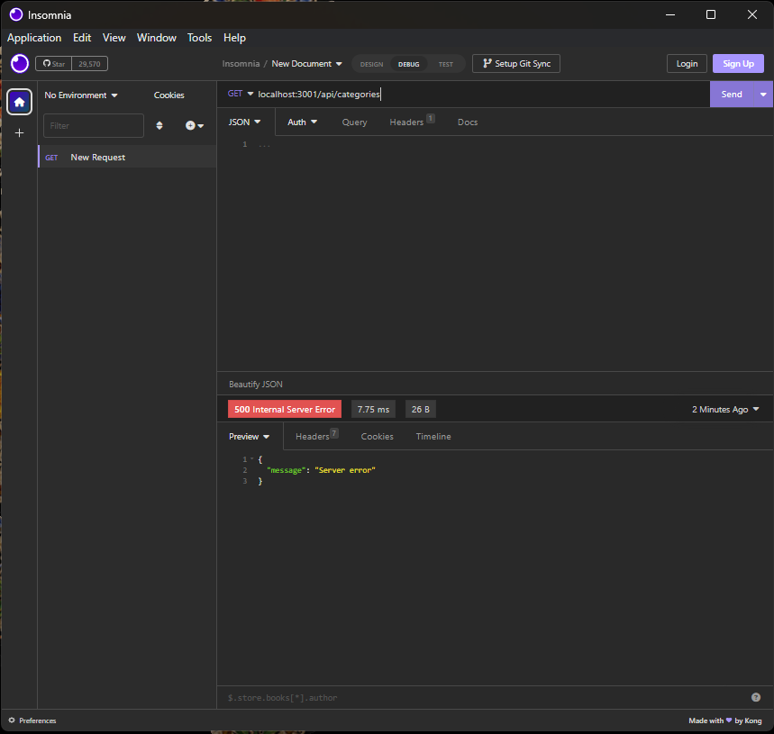

# E-commerce Back End

The E-commerce Back End manages a database for an online store. It handles inventory, and it helps handle sales. It's designed for use by a store owner, or by an agent of a store owner.

There should be functionality to do CRUD operations for products, the product categories, and the product tags.

It uses Sequilize to connect to a SQL database, and uses express.js for middleware.

## Usage Instructions

In the root directory (that is, the same directory as `.env.EXAMPLE`) there needs to be a file named `.env`; that `.env` file needs to have the same three lines as the `env.EXAMPLE` does, only it needs to have the `''` parts filled in.

In a terminal, enter `npm run seed` to seed the database.

In a terminal, enter `npm start` to start the server. It should be running on port 3001.

## Screenshots

A screencap of something you're not proud of is still better than no screencap at all.

## Future Development

Unfortunately, the project did not have time to impliment even the most basic functionality. We still strive for minimum viability.